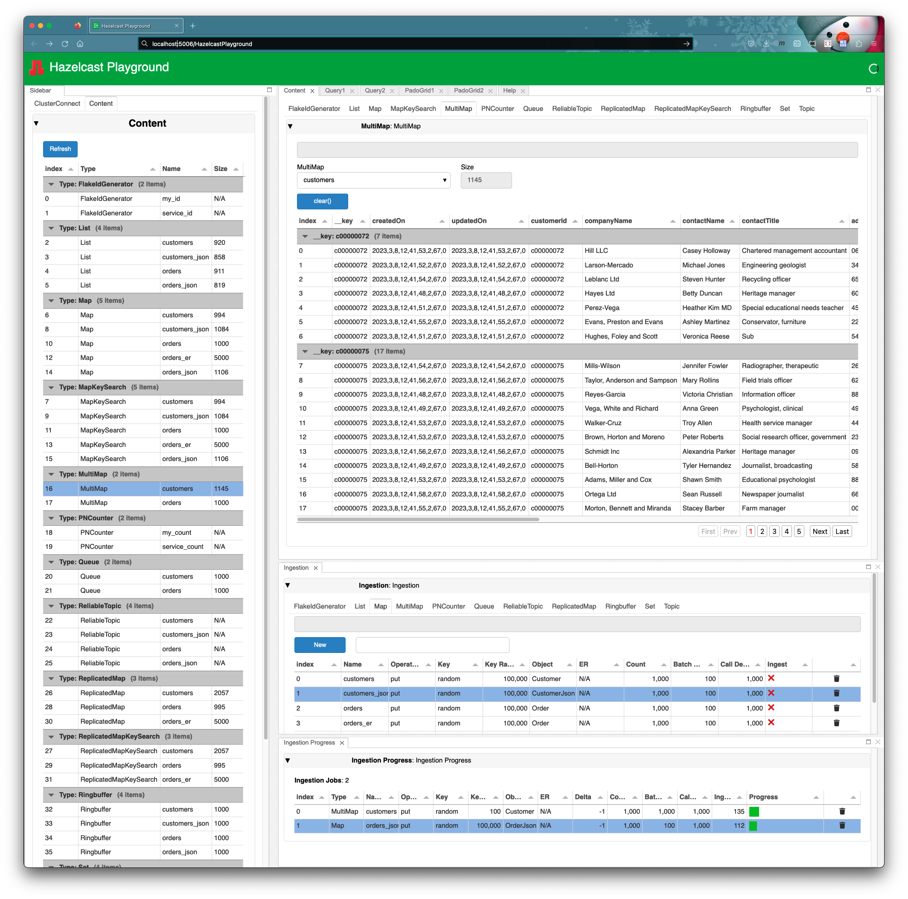

 [*PadoGrid*](https://github.com/padogrid) | [*Catalogs*](https://github.com/padogrid/catalog-bundles/blob/master/all-catalog.md) | [*Manual*](https://github.com/padogrid/padogrid/wiki) | [*FAQ*](https://github.com/padogrid/padogrid/wiki/faq) | [*Releases*](https://github.com/padogrid/padogrid/releases) | [*Templates*](https://github.com/padogrid/padogrid/wiki/Using-Bundle-Templates) | [*Pods*](https://github.com/padogrid/padogrid/wiki/Understanding-Padogrid-Pods) | [*Kubernetes*](https://github.com/padogrid/padogrid/wiki/Kubernetes) | [*Docker*](https://github.com/padogrid/padogrid/wiki/Docker) | [*Apps*](https://github.com/padogrid/padogrid/wiki/Apps) | [*Quick Start*](https://github.com/padogrid/padogrid/wiki/Quick-Start)

---

<!-- Platforms -->
[](https://github.com/padogrid/padogrid/wiki/Platform-Host-OS) [](https://github.com/padogrid/padogrid/wiki/Platform-VM) [](https://github.com/padogrid/padogrid/wiki/Platform-Docker) [](https://github.com/padogrid/padogrid/wiki/Platform-Kubernetes)

# PadoGrid Hazelcast Playground

This bundle includes Hazelcast Playground, a web app for browsing and updating Hazelcast data structures. 

## Installing Bundle

```bash
install_bundle -download bundle-hazelcast-5-playground-python
```

## Use Case

This bundle includes Hazelcast Playground, a web app for browsing and updating Hazelcast data structures. Hazelcast Playground is written in Python using the [Panel](https://panel.holoviz.org/) GUI framework. It touches on the core operations of each Hazelcast data structure in a playground setting where you can try out the Hazelcast API without coding. It provides a quick and easy way to navigate each data structure and ingest mock data as needed.



## Required Software

- Python 3.7+
- Hazelcast 5.1+

## Bundle Contents

```console
apps
└── playground
```

## Installation Steps

1. Install Python 3.7+

2. Install the required Python packages

```bash
pip install hazelcast-python-client panel pandas Faker cryptography 
```

The [`requirements.txt`](apps/playground/requirements.txt) file lists the package versions used in the author's Python environment for running Playground.

3. Create Hazelcast cluster

Create a Hazelcast cluster if you do not have one already.

```bash
make_cluster -product hazelcast -cluster myhz
```


## Startup Sequence

### 1. Start cluster

```bash
switch_cluster myhz
start_cluster
```

### 2. Start Hazelcast Playground

```bash
cd_app playground/bin_sh

# To run on localhost:5006
./start_playground

# To run on a specific address and port
./start_playground -ip localhost -port 5006
```

- URL: <http://localhost:5006/HazelcastPlayground>

### 3. Connect and Play

Once you have connected to Playground from your browser, read the [*Help*](apps/playground/src/main/python/padogrid/hazelcast/playground/help.md) tab which provides Playground guidelines, instructions, and limitations.

## Configuration

Playground places the default configuration file, `playground.yaml` in the `$PLAYGROUND_HOME/etc` directory when you start it for the first time. By default, `PLAYGROUND_HOME` is set to the app directory path in the `bin_sh/setenv.sh` file. After you have started Playground, take a look at the `etc/playground.yaml` file to get familiar with the configuration options. The default configuration includes `Customer` and `Order` data classes in the form of Porable and JSON along with one-to-many entity relationships between Customer and Order objects. You can add your own data classes and create entity relationships by following the guidelines provided in the [Data Classes](#data-classes) section.

```bash
cd_app playground/bin_sh
cat etc/playground.yaml
```

:pencil2: If Playground fails to start, then it is likely that the `etc/playground.yaml` file is not valid. You may need to correct the problems or just remove/rename the file and restart Playground.

Output of `playground.yaml`:

```yaml
# Configuration element's name is "serialization".
# * "portable-factories":
#     Lists your class implementations of Hazelcast's PortableFactory. Each factory has the required "factory-id"
#     attribute that you should give as the ID of your factory. If "factory-id" is not defined then module.FACTORY_ID
#     must be provided. Each class defined in the module must provide CLASS_ID.
#
serialization:
    portable-factories:
        - factory-id: 1
          module-name: padogrid.hazelcast.playground.nw_portable

#
# Configuration element's name is "objects".
# * "objects":
#     Lists object creation functions for creating Portable or JSON objects. The functions that
#     create JSON objects must return dictionary instances, which are internally wrapped in
#     HazelcastJsonValue.
#
objects:
    Customer: padogrid.hazelcast.playground.mock_data.create_customer
    Order: padogrid.hazelcast.playground.mock_data.create_order
    CustomerJson: padogrid.hazelcast.playground.mock_data_json.create_customer
    OrderJson: padogrid.hazelcast.playground.mock_data_json.create_order

#
# er - Entity Relationships. Defines one-to-one or one-to-many relationships.
#   from - takes one data structure name
#   to - takes multiple data structure names
#
#   'object' is one of the objects defined under 'objects:'. If undefined, throws AttributeException.
#   'attributes' lists one or more attributes. Each attribute must define the 'from' and 'to' object
#                attributes. The 'to' object attribute is set to `from` object attribute.
#   'otm' stands for one-to-many and defines the max number of child objects. Must be >= 0. Default: 1
#   'otm_type' must be 'random' or 'exact'. Default: 'exact'
#
er:
    # Customer_Order creates one Customer object with 0 to 5 Order objects.
    # Order objects are stored in the data structure named 'orders_er'.
    Customer_Order:
        orders_er:
            object: Order
            attributes:
                - attribute:
                    from: __key
                    to: customerId
            otm: 5
            otm-type: random

    # Customer_Order_Json creates one Customer object with exactly 5 OrderJson objects.
    # OrderJson objects are stored in the data structure named 'orders_er_json'.
    Customer_Order_Json:
        orders_er_json:
            object: OrderJson
            attributes:
                - attribute:
                    from: customerId
                    to: customerId
            otm: 5
            otm-type: exact
```

## Data Classes

To add your `Portable` classes in Playground, you must provide the module file that includes `FACTORY_ID` and classes with `CLASS_ID` as shown below. Use the [`nw_portable.py`](apps/playground/src/main/python/padogrid/hazelcast/playground/nw_portable.py) module as a reference for creating your data classes.

### `nw_portable.py` snippets

```python
from hazelcast.serialization.api import Portable
...

FACTORY_ID = 1

...

class Customer(Portable):
   CLASS_ID = 101

...

class Order(Portable):
   CLASS_ID = 109

...
```

### Object Creation Functions

To add your own data objects, you must implement object creation fuctions. Each function must return a tuble of an object instance and a key.

**foo.py**

```python
def create_foo(key=None, er_key=None, key_type='random', key_range=100_000_000):
    '''Returns a new Foo object.
    '''

    # Create a new key if the specified key is None
    if key == None:
        key = ...
    
        # Valid key_type: random, uuid, custome
        if key_type == 'random':
            num = random.randint(0, key_range-1)
            key = str(num)
        elif key_type == 'uuid':
            key = str(uuid.uuid4())
        elif key_type == 'custom':
            key = ...

    # Create a new object
    foo = ...

    # If you choose to support ER then set the ER key.
    # This example creates a new ER key if not defined and
    # sets it to 'someAttribute' of the foo object.
    if er_key == None:
        num = random.randint(0, key_range-1)
        er_key = str(num)
    foo.someAttribute = er_key

    # Return the new object and key
    return foo, key
```

You must also include the creation functions in the `playground.yaml` file.

```yaml
...
objects:
    Foo: foo.create_foo
...
```

### Entity Relationships (ER)

You can create one-to-one or one-to-many entity relationships in the `playground.yaml` file. For example, the following sets the key value (identified by `__key`) of the `from` object that is being ingested to the `customerId` attribute of up to five (5) Order objects. If the `from` object has the class type of `Customer` then its key is set to up to five (5) Order objects ingested in the `orders_er` data structure. This effectively provides one-to-many relationships, i.e., a customer has many orders.

```yaml
...
er:
    # Customer_Order creates one Customer object with 0 to 5 Order objects.
    # Order objects are stored in the data structure named 'orders_er'.
    Customer_Order:
        orders_er:
            object: Order
            attributes:
                - attribute:
                    from: __key
                    to: customerId
            otm: 5
            otm-type: random
...
```

You can reference any attributes defined by the `from` and `to` objects. For example, the following uses `customerId` of the `from` object instead of `__key`, resulting the effect as the previous example.

```yaml
    # Customer_Order_Json creates one Customer object with exactly 5 OrderJson objects.
    # OrderJson objects are stored in the data structure named 'orders_er_json'.
    Customer_Order_Json:
        orders_er_json:
            object: OrderJson
            attributes:
                - attribute:
                    from: customerId
                    to: customerId
            otm: 5
            otm-type: exact
```

## Teardown

```bash
cd_app playground/bin_sh

# To view running playground
./show_playground

# To gracefully stop:
./stop_playground

# To kill (-9):
./stop_playground -kill
```

## References

1. Anaconda, *Anaconda offers the easiest way to perform Python/R data science and machine learning on a single machine*, <https://www.anaconda.com/>
1. Faker, *A Python package for generating fake data*, <https://faker.readthedocs.io/en/master/>
1. Hazelcast Python Client Documentation, <https://hazelcast.readthedocs.io/en/stable/>
1. Miniconda, *A free minimal installer for conda*, <https://docs.conda.io/en/latest/miniconda.html>
1. pandas, *A fast, powerful, flexible and easy to use open source data analysis and manipulation tool*, <https://pandas.pydata.org/>
1. Panel, *A high-level app and dashboarding solution for Python*, <https://panel.holoviz.org/>
1. Python, *Downloads*, <https://www.python.org/downloads/>

---

 [*PadoGrid*](https://github.com/padogrid) | [*Catalogs*](https://github.com/padogrid/catalog-bundles/blob/master/all-catalog.md) | [*Manual*](https://github.com/padogrid/padogrid/wiki) | [*FAQ*](https://github.com/padogrid/padogrid/wiki/faq) | [*Releases*](https://github.com/padogrid/padogrid/releases) | [*Templates*](https://github.com/padogrid/padogrid/wiki/Using-Bundle-Templates) | [*Pods*](https://github.com/padogrid/padogrid/wiki/Understanding-Padogrid-Pods) | [*Kubernetes*](https://github.com/padogrid/padogrid/wiki/Kubernetes) | [*Docker*](https://github.com/padogrid/padogrid/wiki/Docker) | [*Apps*](https://github.com/padogrid/padogrid/wiki/Apps) | [*Quick Start*](https://github.com/padogrid/padogrid/wiki/Quick-Start)
